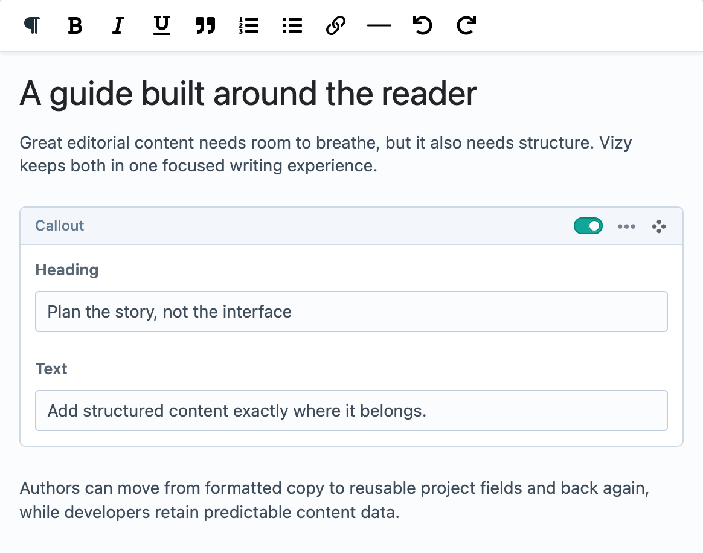
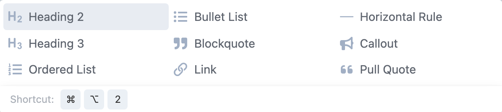
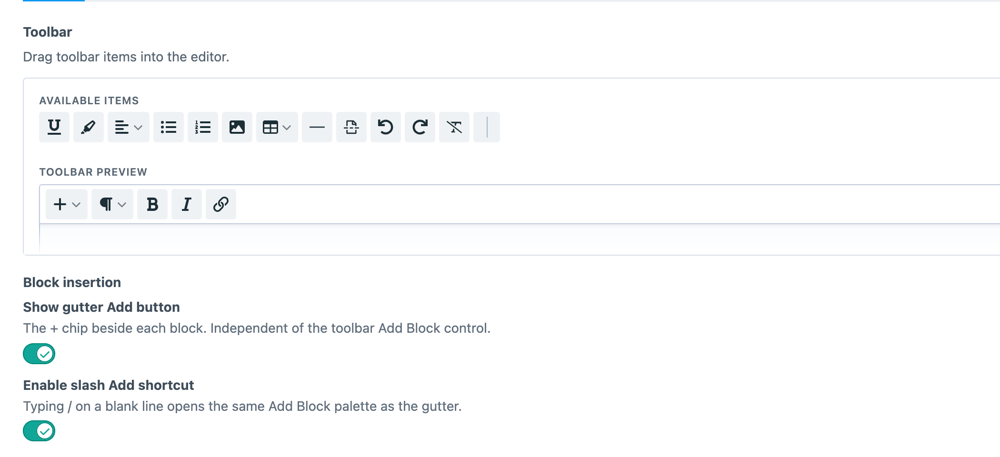
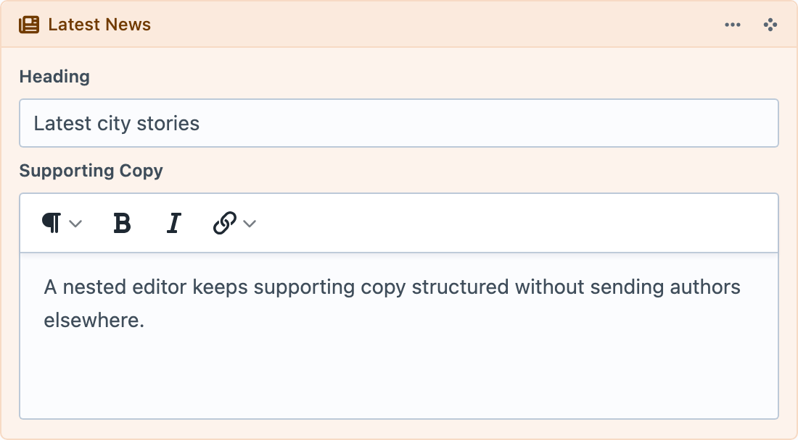

<!-- feature-intro -->
A powerful and flexible content editor that brings rich text and structured Craft content together in one visual editing experience.
<!-- feature-intro-end -->

<!-- vizy-demo -->
## Take Vizy for a spin

Show, don’t tell, is often the best approach. Give Vizy a test-drive below, then switch between the rendered preview and the structured JSON document behind the field.
<!-- vizy-demo-end -->

<!-- feature-media -->
## WYSIWYG, but more

Vizy has all the formatting authors expect — headings, lists, links, tables, images and more — without stopping at rich text. Add purpose-built blocks exactly where they belong, tailor the available tools to the field and keep the whole story in one editing surface.

Blocks stay visible where they will matter in the finished piece. Move, collapse, enable or disable them without turning the document into a disconnected stack of fields.

<!-- feature-media-end -->

<!-- feature-media media-size="small" -->
## Blocks are here

Embed structured blocks directly between paragraphs — much like having Matrix blocks inline with your content. Each Block Type can reuse Craft fields, UI elements and tabs, then render through its own focused Twig template.

Add one from the toolbar, the gutter beside the document or a `/` shortcut on a blank line. Available Block Types remain searchable and grouped so the choices stay approachable as the project grows.

<!-- feature-media-end -->

<!-- feature-media -->
## Shape every editor for its job

Named Editor Configs let a project define its toolbar, content capabilities, Bubble Menu and insertion controls once, then reuse that experience across fields. A short introduction can stay deliberately small while a long-form article gets tables, media, layouts and the full editorial toolkit.

Build configs visually with the real toolbar in front of you, or keep them in `config/vizy/*.json` when they belong in code and deployment workflows.

<!-- feature-media-end -->

<!-- feature-media -->
## Go deeper when the content model calls for it

Hosted Vizy fields can live inside a Block Type alongside ordinary Craft fields. That gives genuinely nested content a focused editor of its own while keeping it part of the parent document.

Use the extra level where it clarifies the model — for example, supporting copy inside a Latest News component — while simpler Blocks remain simple.

<!-- feature-media-end -->

<!-- feature-section -->
## A block-based visual editor

Rather than treating generated HTML as the source of truth, Vizy stores a structured JSON document. Let Vizy render the whole field, give every Block Type its own Twig template, take control node by node or expose the document through GraphQL for a headless front end.
<!-- feature-section-end -->

<!-- feature-grid -->
- :icon[gauge] **Lean content loading** Keep Blocks in the field’s document instead of loading every Block as a separate element.
- :icon[filter] **Familiar content queries** Filter, sort, limit and search nodes and Blocks with an API inspired by Craft element queries.
- :icon[columns-3] **Layouts and columns** Arrange prose, media and Blocks into responsive column structures inside the document.
- :icon[network] **Ready for headless builds** Query the document, its nodes and the Craft fields inside Blocks through structural GraphQL types.
- :icon[database-import] **Bring content with you** Import Vizy content through Feed Me and move Vizy 3 projects forward with resumable, verified migrations.
- :icon[plug-connected] **Built to be extended** Register project-specific nodes, marks, controls and rendering behaviour through documented PHP and JavaScript APIs.
- :icon[heart-handshake] **Supporting open source** Every Vizy licence contributes funding to [Tiptap](https://tiptap.dev/) and [ProseMirror](https://prosemirror.net/), the open-source projects behind the editor.
<!-- feature-grid-end -->
